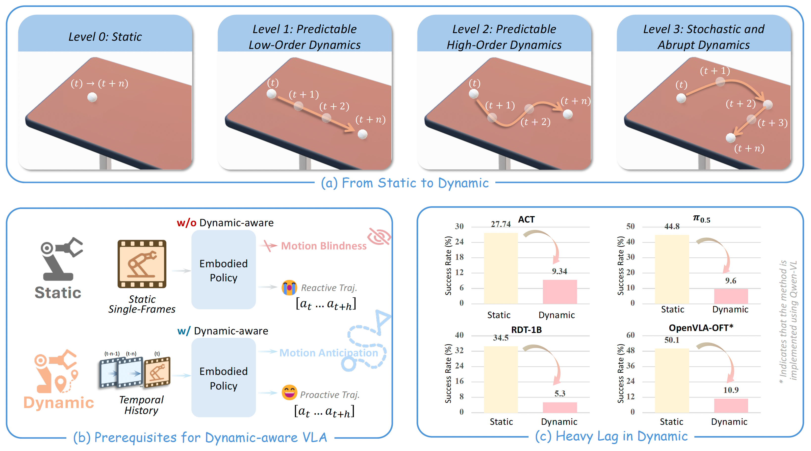
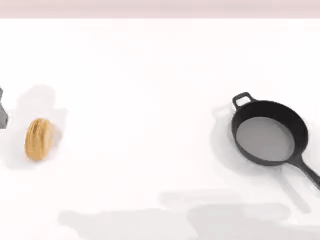
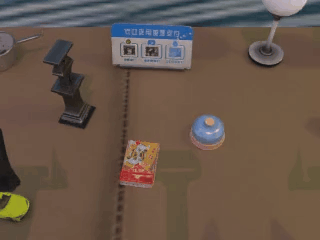

<h2 align="center"> Towards Generalizable Robotic Manipulation in Dynamic Environments </h2>

<div align="center">
    <a href="https://arxiv.org/abs/2603.15620"></a>
    <a href="https://h-embodvis.github.io/DOMINO/"></a>
    <a href="https://opensource.org/licenses/Apache-2.0"></a>

<h5 align="center"><em>Heng Fang<sup>1</sup>, Shangru Li<sup>1</sup>, Shuhan Wang<sup>1</sup>, Xuanyang Xi<sup>2</sup>, Dingkang Liang<sup>1</sup>, Xiang Bai<sup>1</sup> </em></h5>
<sup>1</sup> Huazhong University of Science and Technology, <sup>2</sup> Huawei Technologies Co. Ltd 
</div>


## 🔍 Overview

Dynamic manipulation requires robots to continuously adapt to moving objects and unpredictable environmental changes. Existing Vision-Language-Action (VLA) models rely on static single-frame observations, failing to capture essential spatiotemporal dynamics. We introduce **DOMINO**, a comprehensive benchmark for this underexplored frontier, and **PUMA**, a predictive architecture that couples historical motion cues with future state anticipation to achieve highly reactive embodied intelligence.

<div  align="center">    
 
</div>

<details>
  <summary>Abstract
  </summary>

Vision-Language-Action (VLA) models excel in static manipulation but struggle in dynamic environments with moving targets. This performance gap primarily stems from a scarcity of dynamic manipulation datasets and the reliance of mainstream VLAs on single-frame observations, restricting their spatiotemporal reasoning capabilities. To address this, we introduce DOMINO, a large-scale dataset and benchmark for generalizable dynamic manipulation, featuring 35 tasks with hierarchical complexities, over 110K expert trajectories, and a multi-dimensional evaluation suite. Through comprehensive experiments, we systematically evaluate existing VLAs on dynamic tasks, explore effective training strategies for dynamic awareness, and validate the generalizability of dynamic data. Furthermore, we propose PUMA, a dynamics-aware VLA architecture. By integrating scene-centric historical optical flow and specialized world queries to implicitly forecast object-centric future states, PUMA couples history-aware perception with short-horizon prediction. Results demonstrate that PUMA achieves state-of-the-art performance, yielding a 6.3% absolute improvement in success rate over baselines. Moreover, we show that training on dynamic data fosters robust spatiotemporal representations that transfer to static tasks.
</details>

### 🎥 Visual Demos

More visual demos can be found on our [project homepage](https://h-embodvis.github.io/DOMINO/).

<div align="center">
  
  
  
</div>
<div align="center">
  
  
  
</div>

### ✨ Key Idea

* Current VLA models struggle with dynamic manipulation tasks due to a scarcity of dynamic datasets and a reliance on single-frame observations.
* We introduce DOMINO, a large-scale benchmark for dynamic manipulation comprising 35 tasks and over 110K expert trajectories.
* We propose PUMA, a dynamics-aware VLA architecture that integrates historical optical flow and world queries to forecast future object states.
* Training on dynamic data fosters robust spatiotemporal representations, demonstrating enhanced generalization capabilities.


## 📅 TODO
* [x] Release the paper
* [x] Release DOMINO benchmark code
* [ ] Release DOMINO dataset (HuggingFace and ModelScope)
* [ ] Release PUMA training code and evaluation code
* [ ] Release PUMA checkpoint
* [ ] Support Huawei Ascend NPUs


## 🛠️ Getting Started

This project is divided into two main components that operate in separate environments and communicate via WebSockets:
- **DOMINO**: The simulation environment and data generation pipeline.
- **PUMA**: The Vision-Language-Action policy framework.

You will need to set up both environments to run the full pipeline.

### 1. DOMINO (Simulation & Data Pipeline)

#### 1.0. System Requirements
- **OS**: Linux (Windows/MacOS have limited or no support)
- **Hardware**: NVIDIA GPU (RTX recommended for ray tracing)
- **Software**: Python 3.10, CUDA 12.1 (Recommended), NVIDIA Driver >= 520

*Note: If running inside a Docker container, you must include the graphics capability to avoid Vulkan-related segmentation faults:*
```bash
docker run ... -e NVIDIA_DRIVER_CAPABILITIES=compute,utility,graphics
```

#### 1.1. Installation Steps

**Step 1: Install System Dependencies**
Ensure Vulkan and FFmpeg are installed on your system:
```bash
sudo apt update
sudo apt install libvulkan1 mesa-vulkan-drivers vulkan-tools ffmpeg
```
*(Verify installations by running `vulkaninfo` and `ffmpeg -version`)*

**Step 2: Create Conda Environment**
```bash
conda create -n domino python=3.10 -y
conda activate domino
```

**Step 3: Clone and Install**
```bash
git clone https://github.com/h-embodvis/DOMINO.git
cd DOMINO

# Install basic environments and CuRobo
bash script/_install.sh
```
*Troubleshooting: If you encounter a CuRobo config path issue, run `python script/update_embodiment_config_path.py`. A failed PyTorch3D installation won't affect core functionality unless you are using 3D data.*

**Step 4: Download Assets**
Download the required assets (RoboTwin-OD, Texture Library, and Embodiments). If you hit rate limits, log in to Hugging Face first (`huggingface-cli login`).
```bash
bash script/_download_assets.sh
```

#### 1.2. Data Collection

We provide an automated pipeline for data collection. You can collect data by running:

```bash
bash collect_data.sh ${task_name} ${task_config} ${gpu_id}
# Example: bash collect_data.sh beat_block_hammer demo_clean_dynamic 0
```

After collection, the data will be stored under `data/${task_name}/${task_config}` in **HDF5 format**. For the full data collection process and common issues, please refer to the [RoboTwin Data Collection Tutorial](https://robotwin-platform.github.io/doc/usage/collect-data.html).

**Dynamic Task Configurations**

To enable dynamic environments, we introduce four specific configurations in the task config files (e.g., `task_config/demo_clean_dynamic.yml` and `task_config/demo_random_dynamic.yml`):

<details>
<summary><b>Click to view Dynamic Configurations</b></summary>

- `use_dynamic` (bool): Whether to enable dynamic motion in the environment (e.g., moving objects).
- `dynamic_level` (int): The complexity level of the dynamic motion (1, 2, or 3). Higher levels introduce more challenging dynamic behaviors.
- `dynamic_coefficient` (float): A scaling factor (default: 0.1) that controls the speed of the dynamic movements.
- `check_render_success` (bool): Whether to verify rendering success during data collection, ensuring that dynamic interactions do not cause visual or physical glitches.

</details>

For all other detailed configurations (like domain randomization, cameras, and data types), we maintain the original RoboTwin 2.0 settings. You can find more information in the [RoboTwin Configurations Tutorial](https://robotwin-platform.github.io/doc/usage/configurations.html).

#### 1.3. Policy Evaluation

To evaluate a trained policy, use the following command. The `task_config` field refers to the evaluation environment configuration, while the `ckpt_setting` field refers to the training data configuration used during policy learning.

```bash
bash eval.sh ${task_name} ${task_config} ${ckpt_setting} ${expert_data_num} ${seed} ${gpu_id}

# Example: Evaluate a policy trained on `demo_clean_dynamic` and tested on `demo_clean_dynamic`
# bash eval.sh beat_block_hammer demo_clean_dynamic demo_clean_dynamic 50 0 0
```

<details>
<summary><b>Click to view Dynamic Adaptations in Evaluation</b></summary>

To better evaluate dynamic manipulation, we have introduced several modifications in `script/eval_policy.py` and `script/eval_metrics.py`:

- **Enhanced Evaluation Metrics**: Alongside the standard Success Rate (SR), we introduce the **Manipulation Score (MS)**, a comprehensive metric that evaluates route completion while applying penalties for undesirable behaviors (e.g., collisions or out-of-bounds).
- **Strict Success Conditions**: We added rigorous success criteria for dynamic objects, including **out-of-bounds detection** (failing if the object leaves the workspace before grasping) and **lifting verification** (ensuring the object is lifted beyond a specific height threshold to prevent false positives from accidental touches).

</details>

**Note**: The policy evaluation framework is fully compatible with **RoboTwin 2.0**. You can seamlessly migrate and evaluate any policies between the two repositories by simply loading a new task configuration within our codebase. 

### 2. PUMA (VLA Policy)

*Instructions for setting up the PUMA environment are coming soon...*


## 👍 Acknowledgement

We build upon the following great works and open source repositories
* [RoboTwin 2.0](https://github.com/RoboTwin-Platform/RoboTwin)
* [starVLA](https://github.com/starVLA/starVLA)
* [Grounded-SAM-2](https://github.com/IDEA-Research/Grounded-SAM-2)
* [SAPIEN](https://github.com/haosulab/SAPIEN)


## 📖 Citation

```bibtex
@article{fang2026towards,
      title={Towards Generalizable Robotic Manipulation in Dynamic Environments},
      author={Fang, Heng and Li, Shangru and Wang, Shuhan and Xi, Xuanyang and Liang, Dingkang and Bai, Xiang},
      journal={arXiv preprint arXiv:2603.15620},
      year={2026}
}
```